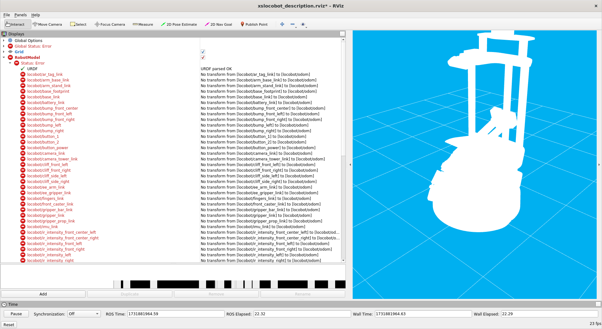

# Issues and Troubleshooting

## Problem 1: Connecting to Display's

#### Command

```bash
roslaunch interbotix_xslocobot_descriptions remote_view.launch
```

#### Issue
```bash
Xf11 connection rejected because of wrong authentication.
qt.qpa.xcb: could not connect to display localhost:10.0
qt.qpa.plugin: Could not load the Qt platform plugin "xcb" in "" even though it was found.
This application failed to start because no Qt platform plugin could be initialized. Reinstalling the application may fix this problem.

Available platform plugins are: eglfs, linuxfb, minimal, minimalegl, offscreen, vnc, xcb.

[locobot/rviz-1] process has died [pid 158, exit code -6, cmd /opt/ros/noetic/lib/rviz/rviz -f locobot/odom -d /interbotix_ws/src/interbotix_ros_rovers/interbotix_ros_xslocobots/interbotix_xslocobot_descriptions/rviz/xslocobot_description.rviz /clicked_point:=clicked_point /initialpose:=initialpose /move_base_simple/goal:=move_base_simple/goal __name:=rviz __log:=/root/.ros/log/18779788-9fc4-11ef-9492-e70eec1a9668/locobot-rviz-1.log].
log file: /root/.ros/log/18779788-9fc4-11ef-9492-e70eec1a9668/locobot-rviz-1*.log
all processes on machine have died, roslaunch will exit
shutting down processing monitor...
... shutting down processing monitor complete
done
```

### Possible Solution 

ensure that X-forwarding is allowed and all Display variables for the Remote Computer, Server, and Container with the server are set to the same varible.

- You can do this by running this command on all three devices
````bash
echo $DISPLAY
````
- if these variables are different in any of the three devices then this could be an issue, to solve this...

```bash
export DISPLAY=localhost:10.0
```

#### Note: this doesn't allways work, there are other issues that I have not yet found

#### Revision

I tried to run:

```bash
roslaunch interbotix_xslocobot_descriptions remote_view.launch
```

again on the remote computer and obtained same issue seen above.

### Unlikley Solution: 

Although this operation isn't currently permitted, this is still a possible solution. Check that X11 forwarding is allowed on the SSH server. In  '/etc/ssh/sshd_config'  , ensure these lines are set correctly:


first, run: 
```bash
nano /etc/ssh/sshd_config
```

Then ensure these variables are set:
```bash
X11Forwarding yes
X11DisplayOffset 10
X11UseLocalhost yes
```

Then Restart the SSH service after making changes:

```bash
sudo service ssh restart
```

Note: This wasn't allowed, permission was denied.

## Possible Solution: 

We need to ensure that access control is enabled!

on remote PC run:
```bash
xhost +
```
Now rviz should pop-up!

## Odometry Issues

#### This has been a long standing issue, there are a couple of possible solutions


#### Quick solution
I found this [solution](https://github.com/Interbotix/interbotix_ros_rovers/issues/25) on trossen's github issues page linked below. If all you need to do is go into rviz, or you don't have time to go over the long solution below you can always get the robot figure in rviz. Note that this messes up the base odometry and therefore you aren't able to move the robot with the navigation or joystick packages, (at least that's my expirence).


```bash
roslaunch interbotix_xslocobot_descriptions remote_view.launch rviz_frame:=locobot/base_link
```

#### Once you re-run rviz you, the rviz_frame should look like this
