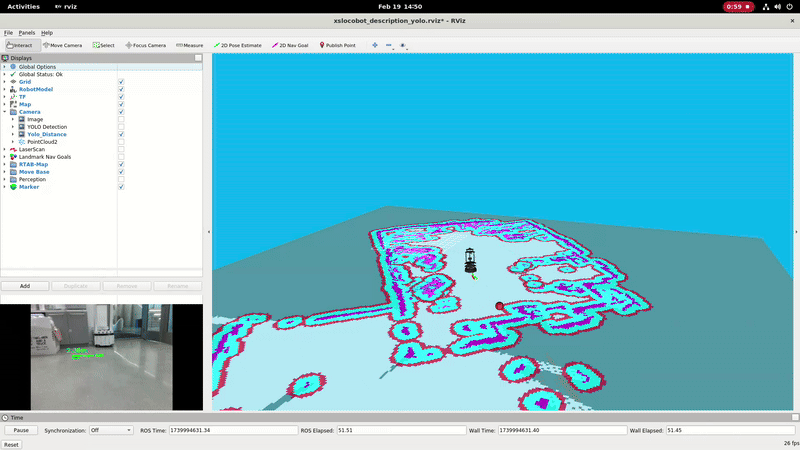

# Locobot Documentation

By: Adrián Noé Ramírez

This repository contains resources, documentation, and scripts for working with Locobot using ROS1 and ROS2. Below is an overview of the folder structure and their contents, with proper links to all files.

---

## Latest Work

Checkout the [scan and object script](/src/move_to_pose/scripts/scan_and_approach_node.py) and [approach object launch file](/src/move_to_pose/launch/scan_and_approach.launch) for my latest work in autonomus navigation.

<div align="center">
  
  <p><em>Object Approach (Demo)</em></p>
</div>

---

## Other Demos

<div align="center">
  
  <p><em>YOLO Vision in action (Demo)</em></p>
</div>

<div align="center">
  
  <p><em>Object Mapper (Demo)</em></p>
</div>


---

## Directory Structure
### YOLO Vision (ROS 1)

### [ROS1](ROS1)
Contains resources, issues, dockerfile, and quick setup for ROS1.

---

### [ROS2 Integration (Failed)](ROS2_Integration_Failed)

Contains resources and documentation for ROS2 integration with Locobot. This integration attempt failed due to RMW (ROS Middleware) configuration incompatibilities between the Intel NUC and iRobot Create3 base, preventing proper communication between components.

---

### [src](src)

Contains packages:

- [yolo_vision](/src/yolo_vision): A package that uses computer vision to find an object, find it's distance from the robot, and map the object within the robot map.
- [move_to_pose](/src/move_to_pose/): The package that controls finding objects/foraging refer to the [scan and approach](/src/move_to_pose/scripts/move_to_pose_scan_node.py), in addition to other helper packages for testing and position recording

- [video_recorder](/src/video_recorder/): Another helper package that takes in the feed of the robot camera, and records a video (used to create single frames to train the computer vision model)

#### for more information vist the respetive [src](/src/readme.md) readme

## How to Use This Repository
1. Navigate to the relevant section based on your needs:
   - **ROS1 Users:** Refer to the `ROS1` folder.
   - **ROS2 Users:** Refer to the `ROS2_Integration_Failed` folder.
2. Review the Quick Setup Guides for instructions on setting up Locobot for either ROS1 or ROS2.
3. For Docker-based setups, refer to the respective Docker Info sections for ROS1 and ROS2.
4. For the `src` packages, use a git to just copy the respective directory, then run a `catkin_make`

```bash
git clone https://github.com/anramz29/lips_ws.git
```

## Now Navigate and Build the Repository
```bash 
cd lips_ws
catkin_make
source devel/setup.bash 
```
---

## Contributing

If you find any errors or have suggestions for improvements, please submit a pull request or open an issue.

---

## Maintainer

- [Adrián Noé Ramírez](mailto:anramz29@gmail.com)

---
## License
This repository is open-source and available under the MIT License.

