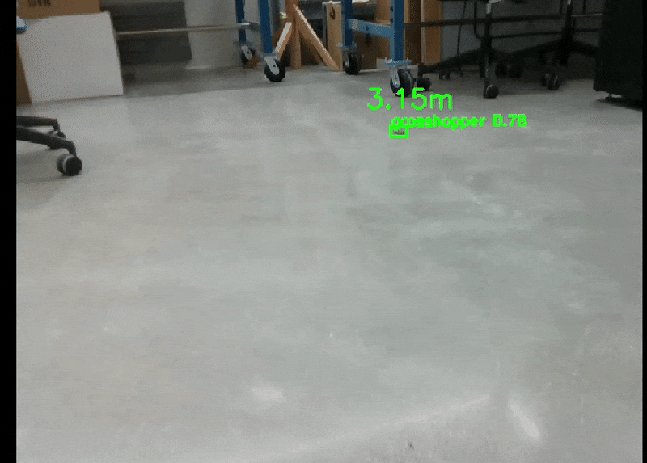

# Locobot Documentation

By: Adrián Noé Ramírez

This repository contains resources, documentation, and scripts for working with Locobot using ROS1 and ROS2. Below is an overview of the folder structure and their contents, with proper links to all files.

---
## Directory Structure
### YOLO Vision (ROS 1)


<div align="center">
  
  <p><em>YOLO Vision in action (Demo)</em></p>
</div>

<div align="center">
  
  <p><em>Object Mapper (Demo)</em></p>
</div>

    

---

### [ROS1](ROS1)
Contains resources, issues, dockerfile, and quick setup for ROS1.

---

### [ROS2 Integration (Failed)](ROS2_Integration_Failed)

Contains resources and documentation for ROS2 integration with Locobot. This integration attempt failed due to RMW (ROS Middleware) configuration incompatibilities between the Intel NUC and iRobot Create3 base, preventing proper communication between components.

### [catkin_ws](catkin_ws)

Contains packages:

- [yolo_vision](catkin_ws/yolo_vision): A package that uses computer vision to find an object, find it's distance from the robot, and map the object within the robot map.
- [move_to_pose](/catkin_ws/move_to_pose/): A helper package that records and names different poses the robot makes on the map and once recorded has another launch script that directs the robot to move to the respective recorded position
- [video_recorder](/catkin_ws/video_recorder/): Another helper package that takes in the feed of the robot camera, and records a video (used to create single frames to train the computer vision model)

#### for more information vist the respetive [catkin_ws](/catkin_ws/readme.md) readme

## How to Use This Repository
1. Navigate to the relevant section based on your needs:
   - **ROS1 Users:** Refer to the `ROS1` folder.
   - **ROS2 Users:** Refer to the `ROS2_Integration_Failed` folder.
2. Review the Quick Setup Guides for instructions on setting up Locobot for either ROS1 or ROS2.
3. For Docker-based setups, refer to the respective Docker Info sections for ROS1 and ROS2.
4. For the `yolo_vision_Ros1` package, use svn to just copy the respective directory

```bash
svn export https://github.com/anramz29/Locobot_Docs/tree/catkin_ws
```
---

## Contributing

If you find any errors or have suggestions for improvements, please submit a pull request or open an issue.

---

## Maintainer

- [Adrián Noé Ramírez](mailto:anramz29@gmail.com)

---
## License
This repository is open-source and available under the MIT License.

