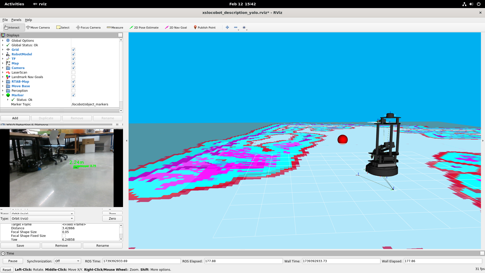

# YOLO Vision ROS Package

A ROS package that implements YOLO object detection with distance estimation for the Locobot platform.

<div align="center">
  
  <p><em>Object Mapper in action (Demo)</em></p>
</div>


<div align="center">
  
  <p><em>YOLO Vision in action (Demo)</em></p>
</div>

## Overview

This package provides nodes for:
- Object detection using YOLO
- Distance estimation using depth camera data
- Visualization in RViz

## Prerequisites

- ROS (tested on ROS Noetic)
- Python 3
- OpenCV
- Ultralytics YOLO
- CvBridge
- Sensor Messages
- Geometry Messages

## Installation

1. Clone this repository into your catkin workspace:
```bash
cd ~/catkin_ws/src
git clone <repository-url>/yolo_vision.git
```

2. Build the package:
```bash
cd ~/catkin_ws
catkin_make
```

3. Source your workspace:
```bash
source ~/catkin_ws/devel/setup.bash
```

## Usage

### Launch YOLO Detection Only

To run only the YOLO detection node:

```bash
roslaunch yolo_vision yolo_vision.launch
```

### Launch YOLO with Distance Estimation

To run both YOLO detection and distance estimation:

```bash
roslaunch yolo_vision yolo_distance.launch
```

### Launch YOLO with Object Mapping

To run YOLO detection with object mapping capabilities:

```bash
roslaunch yolo_vision object_mapper.launch
```


## Parameters

### YOLO Node
- `model_path` (string): Path to YOLO model file (default: `models/best.pt`)
- `image_topic` (string): RGB image topic (default: `/locobot/camera/color/image_raw`)

### Distance Node
- `yolo_image_topic` (string): YOLO annotated image topic
- `depth_image_topic` (string): Depth image topic
- `bbox_depth_topic` (string): Bounding box depth information topic

### Object Mapper Node
- `camera_frame` (string): Camera optical frame (default: `locobot/camera_color_optical_frame`)
- `map_frame` (string): Map frame for object visualization (default: `map`)
- `bbox_depth_topic` (string): Topic for bounding box depth information
- `camera_info_topic` (string): Camera calibration information topic


## Topics

### Subscribed Topics
- `/locobot/camera/color/image_raw` (sensor_msgs/Image)
- `/locobot/camera/depth/image_rect_raw` (sensor_msgs/Image)

### Published Topics
- `/locobot/camera/yolo/annotated_image` (sensor_msgs/Image)
- `/locobot/camera/yolo/visualization` (sensor_msgs/Image)
- `/locobot/camera/yolo/bbox_depth` (std_msgs/Float32MultiArray)
- `/locobot/object_markers` (visualization_msgs/Marker): 3D markers for detected objects

## RViz Configuration

A custom RViz configuration is provided at `yolo_vision/rviz/xslocobot_description_yolo.rviz` that includes:
- RGB camera view
- YOLO detection visualization
- Distance estimation visualization

## File Structure

```
yolo_vision/
├── CMakeLists.txt
├── launch/
│   ├── yolo_vision.launch
│   ├── yolo_distance.launch
│   └── object_mapper.launch
├── models/
│   └── best.pt
├── rviz/
│   └── xslocobot_description_yolo.rviz
└── scripts/
    ├── yolo_node.py
    ├── distance_node.py
    └── object_mapper_node.py
```
